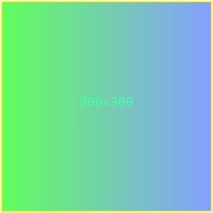
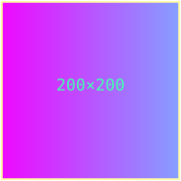

# Example 002

This example references two separate SVG images: one in the same directory as
this markdown file, and one in a sub-directory.

Image in the same directory:

Image in a sub-directory:

